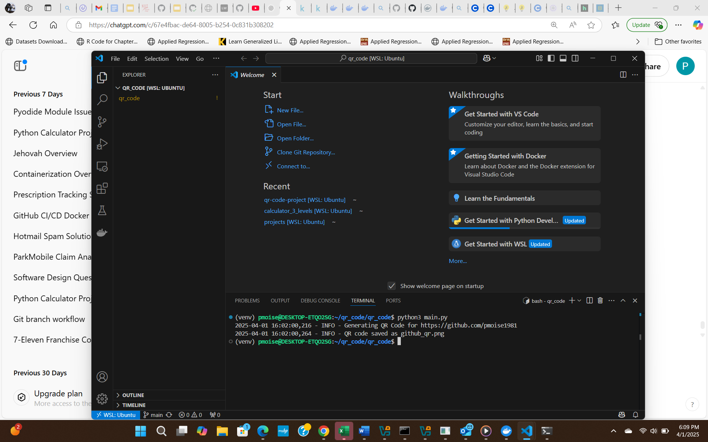

# QR Code Generator

This project generates a QR code that links to a GitHub profile.

## Installation
1. Create a virtual environment:
python -m venv venv source venv/bin/activate # macOS/Linux venv\Scripts\activate # Windows

2. Install dependencies:
pip install -r requirements.txt

3. Run the script:
python main.py

# Using Docker
To build and run:
docker-compose up --build

## QR Code
Scan the QR code below to visit my GitHub page

## Log of successfully creating the QR

